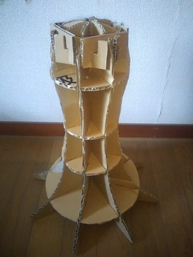
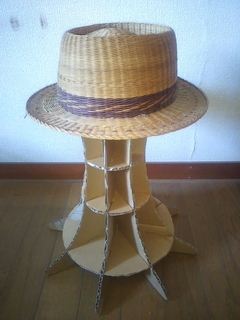
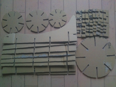
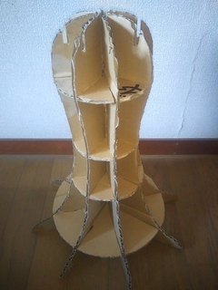
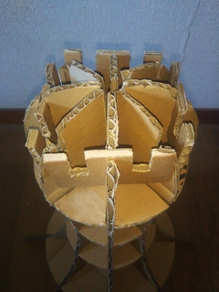
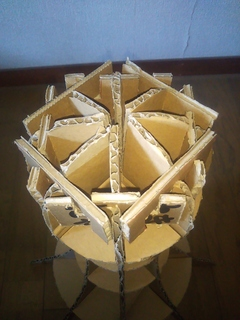
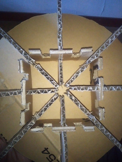
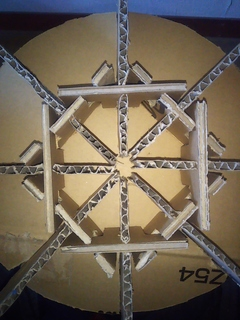

<!-- Document: README.md

ダンボールマネキンヘッドのマニュアル。

Metadata:

	id - 963e0ad7-3c93-4a3a-a10a-cacdc29cfc15
	author - <qq542vev at https://purl.org/meta/me/>
	version - 1.0.2
	created - 2023-04-27
	modified - 2025-05-23
	copyright - Copyright (C) 2023-2025 qq542vev. Some rights reserved.
	license - <CC-BY-4.0 at https://creativecommons.org/licenses/by/4.0/>
	package - danbooru-mannequin-head

See Also:
	* <Project homepage at https://github.com/qq542vev/danbooru-mannequin-head>
	* <Bag report at https://github.com/qq542vev/danbooru-mannequin-head/issues>
-->

# 段ボールマネキンヘッド

 

段ボールマネキンヘッドは段ボールで作成が可能なマネキンの頭部です。耐荷重が高めた設計となっているため、帽子などの軽量なものは勿論、人形着ぐるみのマスクなども置くことも可能です。

完成品の大きさは高さ420mm、横幅337m、奥行き337mmです。重量は約222gです。

ここでは型紙用のテンプレートファイルの配布と作り方を解説しています。型紙用のファイルは [LibreOffice Draw](https://www.libreoffice.org/discover/draw/) を用いて作成されています。

# 作成方法

[Aフルート(5mm厚)](https://www.bestcarton.com/jp/guide/danball/a-flute.html)の段ボールを用意します。新品の段ボール板に限らず、段ボール箱などの折り目のついた段ボール板でも作成が可能です。可能な限り、中芯が潰れていない段ボールを使用しましょう。

[GitHub Release](https://github.com/qq542vev/danbooru-mannequin-head/releases/latest) から template.pdf をダウンロードして、A3の印刷用紙に印刷します。レーザープリンターでは縁が欠けますが、縮小・拡大などはせず、原寸大のまま印刷します。

印刷した紙を切り取り線に沿って裁断し型紙を作成します。カッターなどで型紙に沿って段ボールを裁断します。各パーツの個数は型紙に記載してあります。例えばパーツAは8個必要です。パーツA、パーツE、パーツFには紙巾方向について指定があります。

パーツAの切り込み口 c, d, e にパーツB、パーツC、パーツDの切り込み口にそれぞれ挿入していきます。

上から見た時に四角形が出来るように、4個のパーツAの上部の切り込み口にパーツEの切り込み口 a を挿入していきます。残りの4個のパーツAの上部の切り込み口にパーツFの切り込み口 b を挿入していきます。この時パーツEとパーツFの切込み口 e, f もそれぞれ挿入していきます。

 

パーツAの下部の切り込み口も上部と同様に、パーツEとパーツFを挿入すれば完成です。

 
